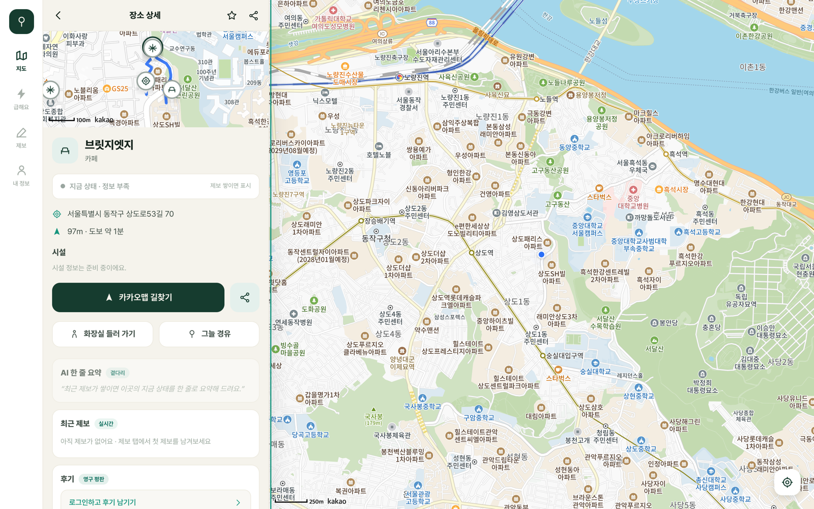
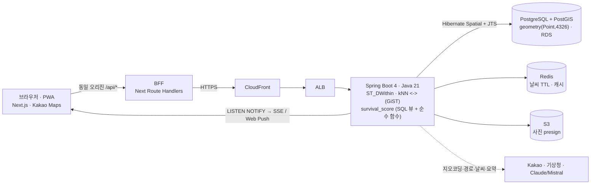

# 그늘 (Geuneul) — 여름 생존 지도

> **PostGIS 대용량 지리검색 + 실시간 UGC 시공간 스코어링.** 전국 공공데이터 **15만+ POI**를 GiST 인덱스로 반경·kNN 검색하고, 휘발성 제보를 *최근성 × 신뢰도*로 SQL에서 집계해 **"지금 갈만함" 점수**로 마커를 3색으로 칠하는 생활 생존 지도.

[](https://geuneul.vercel.app)
[](https://d2pedv974beobb.cloudfront.net/actuator/health)
[](https://d2pedv974beobb.cloudfront.net/swagger-ui.html)
[](https://geuneul.vercel.app/install)

[](#데이터--etl-멱등-적재--지오코딩)
[](./docs/adr/0012-k6-load-explain-index-tuning.md)
[](#기술-스택)
[](./docs/adr/README.md)
[](./TROUBLESHOOTING.md)
[](./LICENSE)

[](https://github.com/hoeongj/geuneul/actions/workflows/ci.yml)
[](https://github.com/hoeongj/geuneul/actions/workflows/frontend-ci.yml)
[](https://github.com/hoeongj/geuneul/actions/workflows/deploy.yml)

[](https://geuneul.vercel.app)

> 위: 장소 상세 — **그늘 경유 경로**(현재 위치→쿨링쉼터를 통과하는 도로 폴리라인) + AI 한 줄 요약 + 제보(휘발)/후기(영구) 2단 UGC. 라이브 실측 캡처. 더 많은 화면은 [아키텍처 문서](./docs/architecture.md#데모).

---

## 무엇을 증명했나

- **공간 엔지니어링(간판)** — 반경 `ST_DWithin` · 최근접 kNN `<->` · bounds를 **PostGIS GiST 인덱스**로. `EXPLAIN`으로 인덱스 사용을 실증하고, **k6 부하테스트로 반경 검색 p95를 2.68s→~1.4s로 튜닝**(병목이 GiST가 아니라 CPU임을 측정으로 확정, [ADR-0012](./docs/adr/0012-k6-load-explain-index-tuning.md)).
- **멱등 ETL + 지오코딩** — `source + source_external_id` 자연키로 **재실행해도 중복 없는** 배치 upsert. 무더위쉼터 60,297 · 공중화장실 52,334 · 도서관 3,551 · 상권 카페/스터디카페 등 **전국 표준데이터를 그대로 적재**하고, WGS84 결측 좌표는 **카카오 지오코딩으로 보완**(결과 저장·rate limit 회피).
- **실시간 UGC 시공간 스코어링** — 제보(휘발성 상태)/후기(영구 평판) **2단 UGC**를 신뢰도 가중으로 `survival_score`에 집계. 제보 급증은 **Postgres `LISTEN/NOTIFY` → 멀티 인스턴스 팬아웃 → SSE**로, 관심 장소 알림은 **`INSERT … RETURNING`으로 정확히 1회** 푸시([ADR-0016](./docs/adr/0016-realtime-report-surge-listen-notify-sse.md)·0026).

> 스택: **Spring Boot 4 · Java 21 · PostgreSQL+PostGIS · Redis · AWS ECS Fargate · Terraform · Next.js(PWA)**. 지리공간은 "지도 그림"이 아니라 **대용량 공간검색을 GiST 인덱스·kNN·EXPLAIN으로 다루는 DB 엔지니어링**이 핵심이다.

## 아키텍처

브라우저는 항상 **동일 오리진 `/api/*` 서버 프록시(BFF)** 만 호출한다 → ALB(http)·CORS 제약을 동시에 회피(백엔드 CORS 불필요, [ADR-0004](./docs/adr/0004-frontend-same-origin-proxy.md)). 간판인 공간검색·시공간 집계는 **DB 레이어(GiST 인덱스 + SQL 뷰)** 에서 돈다.



> 전체 다이어그램(런타임·ETL·배포 CI/CD)과 데모 스크린샷은 **[docs/architecture.md](./docs/architecture.md)**. 배포(AWS·OIDC·Terraform)는 [DEPLOY.md](./DEPLOY.md).

## `survival_score` — 간판이 작동하는 방식

"지금 이 장소가 갈만한가"를 0~100점 + 3색 등급(초록 좋음 / 노랑 보통 / 회색 정보 부족)으로 낸다.

```
survival_score = 0.25·distance + 0.20·comfort + 0.20·freshness − 0.15·risk   (+ open_now: 데이터 붙으면 복원)
freshness 버킷:  0~1h=1.0 | 1~3h=0.8 | 오늘=0.6 | 이번주=0.3 | 그 외=0.1
```

- **시공간 집계는 SQL 뷰**(`place_report_signals`)가, **가중치 조립·등급은 순수 함수**가 담당한다 — 무거운 집계는 DB, 자주 튜닝하는 정책은 테스트 가능한 Java로 분리([ADR-0007](./docs/adr/0007-survival-score-sql-signals-java-compose.md)).
- 제보는 **신뢰도(trust) 가중**, **만료(휘발성)** 제외, 후기(영구 평판)와 분리.
- 없는 성분(운영시간 `open_now`)은 **지어내지 않고 재정규화** — 데이터가 붙으면 가중치 복원만으로 additive 확장.
- 추천은 같은 함수를 **시나리오 가중치로 재사용**한다([ADR-0008](./docs/adr/0008-recommendations-scenario-weighted-ranking.md)).

## 데이터 · ETL (멱등 적재 + 지오코딩)

전국 공공 표준데이터를 **멱등(idempotent)** 하게 적재한다 — 같은 소스를 두 번 넣어도 `source + source_external_id` 자연키 upsert라 중복이 없고, 스냅샷에서 사라진 행은 soft-delete로 비활성화된다. 공중화장실은 2025-02 이후 WGS84 좌표 미제공 → **카카오 로컬 API로 주소→좌표를 보완**하고 결과를 저장한다(멱등·rate limit 회피). 상세 흐름은 [docs/architecture.md](./docs/architecture.md#데이터--etl).

## 빠른 시작 (로컬)

```bash
# 1) 인프라 — PostGIS + Redis
docker compose up -d

# 2) 백엔드 — http://localhost:8080/swagger-ui.html
cd backend && ./gradlew bootRun

# 3) 프론트 — http://localhost:3000  (Kakao JS 키 없으면 지도는 placeholder, 데이터는 정상)
cd frontend && pnpm install && pnpm dev
```

공공데이터 적재는 멱등(재실행해도 중복 없음):

```bash
cd backend
./gradlew bootRun --args='--ingest.source=cooling_shelter --ingest.file=/path/무더위쉼터.csv --ingest.charset=MS949'
```

## API 맛보기

```bash
# 반경 검색 — 가까운 순 + 거리(m) + survival 배지
GET /places?lat=37.4963&lng=126.9575&radius=1000

# 뷰포트(bounds) 마커 — 무더위쉼터
GET /places?bounds=126.93,37.49,126.97,37.52&category=COOLING_SHELTER

# 최근접(kNN) — 서울 밖 어디서나 동작 (예: 부산)
GET /places/nearest?lat=35.2133&lng=129.0157&category=COOLING_SHELTER&limit=3

# 시나리오 추천 — 거리+실시간 상태로 "지금 갈만한 순" (scenario: rest30|restroom|rain|focus|longstay)
GET /recommendations?lat=37.4963&lng=126.9575&scenario=restroom
#   → 각 결과 = 장소(survival 배지) + matchScore(적합도) + reason(제보 요약)

# 휘발성 제보 (익명, 타입별 TTL로 자동 만료 · 분당 3·시간당 10 레이트리밋)
#   lat/lng를 함께 보내면 장소 100m 이내일 때 "방문 인증"(verified)
POST /reports   {"placeId":1,"reportType":"COOL","comment":"에어컨 빵빵","lat":37.4963,"lng":126.9575}
GET  /places/1/reports

# 그늘/화장실 경유 경로 — 현재 위치→도착 사이 우회 최소 쿨링쉼터·화장실 1곳 경유 (ADR-0027)
GET /routes/shade?fromLat=37.50&fromLng=126.95&toLat=37.51&toLng=126.96

# 실시간 제보 급증 알림 — 뷰포트 스냅샷 + SSE 스트림 (ADR-0016)
GET /alerts/surge?bounds=126.93,37.49,126.97,37.52
GET /alerts/stream            # text/event-stream (SSE)
```

## 기술 스택

| | |
|---|---|
| **Backend** | Spring Boot 4 · Java 21 · PostgreSQL + **PostGIS**(Hibernate Spatial + JTS) · Flyway · Redis |
| **Frontend** | Next.js 16(App Router) · TypeScript · Tailwind v4 · TanStack Query · Kakao Maps · Serwist(PWA) — `frontend/` ([README](./frontend/README.md)) |
| **Infra** | AWS ECS Fargate · RDS · **Terraform** · GitHub Actions(OIDC) · ECR · ALB · Vercel |
| **Test/Ops** | Testcontainers(실 PostGIS) · JaCoCo(line 71%·게이트 70%) · k6 부하테스트 · gitleaks · Swagger |

## 문서

- **아키텍처·데모**: [`docs/architecture.md`](./docs/architecture.md) · **의사결정 기록**: [`docs/adr/`](./docs/adr) (ADR 0001–0027, [색인](./docs/adr/README.md))
- **배포(AWS)**: [`DEPLOY.md`](./DEPLOY.md) · **현황·다음 작업**: [`HANDOFF.md`](./HANDOFF.md)
- **면접 STAR**: [`docs/INTERVIEW.md`](./docs/INTERVIEW.md) · **개발 일지**: [`WORKLOG.md`](./WORKLOG.md) · **트러블슈팅**: [`TROUBLESHOOTING.md`](./TROUBLESHOOTING.md)
- 전체 목표·범위·ERD·API 스펙: [`CLAUDE.md`](./CLAUDE.md)

<details>
<summary><b>구현 이력 (W0 → P5 완주)</b></summary>

- **W0** — Spring Boot 4 + PostGIS/Flyway + Testcontainers CI + AWS(ECS Fargate·RDS·Terraform·OIDC) 배포 파이프라인.
- **P1** — 반경/kNN/bounds 공간검색 API 라이브 + 공공데이터 멱등 인제스천(쉼터 100건 + 공중화장실 59,768행 파서 → 카카오 지오코딩으로 52,334건 좌표 보완 + 전국 도서관 3,551건).
- **P2 · UGC+인증** — 휘발성 제보(11타입·타입별 TTL, 레이트리밋 XFF/OOM 하드닝 TS-008) · **소셜 로그인**(카카오/구글 OAuth2+JWT, BFF code 교환) · **후기(review)** 영구 평판(로그인, 장소당 1건 upsert) · **사진 presign**(S3 SigV4, image 화이트리스트) · **trust_score** 실배선(로그인 제보 user_id 가중, V6) · **모더레이션**(신고 + ADMIN 검수 큐, V7).
- **P3 · 스코어·추천·AI·데이터** — `survival_score`(SQL 뷰 + 순수 함수, 마커 3색, [ADR-0007](./docs/adr/0007-survival-score-sql-signals-java-compose.md)) · 시나리오 추천 [ADR-0008](./docs/adr/0008-recommendations-scenario-weighted-ranking.md) · **날씨**(기상청 초단기실황 + Redis TTL 캐시) + comfort 복원([ADR-0009](./docs/adr/0009-weather-comfort-additive-restore.md)) · **AI 한줄요약**(프로바이더 중립 OpenAI 호환 클라이언트, 현재 Mistral, graceful degradation, [ADR-0010](./docs/adr/0010-ai-summary-openrouter-provider.md)) · **공부공간 데이터 확장**(CAFE/STUDY_CAFE·soft-delete, V5, [ADR-0006](./docs/adr/0006-study-space-coverage-expansion.md)) · **주기동기화**(EventBridge→ECS RunTask + advisory lock, ENABLED, [ADR-0011](./docs/adr/0011-scheduled-public-data-sync.md)).
- **P4 · 심화(간판 보강)** — **k6 부하테스트 + EXPLAIN 인덱스 튜닝**(반경/kNN/bounds GiST 사용 실증, V8 만료제보 인덱스, [ADR-0012](./docs/adr/0012-k6-load-explain-index-tuning.md)) · **ECS Service Auto Scaling**(CPU target-tracking, [ADR-0013](./docs/adr/0013-ecs-service-autoscaling.md)) · **관측성**(Micrometer/Prometheus + OTel 트레이싱 + 로컬 Grafana/Tempo, [ADR-0014](./docs/adr/0014-observability-otel-micrometer-grafana.md)) · **무료 HTTPS**(CloudFront 기본 도메인, [ADR-0015](./docs/adr/0015-cloudfront-default-domain-https.md)).
- **P4 · 백로그 완주** — **실시간 제보 급증 알림**(Postgres LISTEN/NOTIFY→SSE, 멀티 인스턴스 팬아웃, V9, [ADR-0016](./docs/adr/0016-realtime-report-surge-listen-notify-sse.md)) · **시간대별 혼잡 파생**(자체 popular-times) · **GPS 방문 인증**(`verified`, ST_DWithin 100m, V10) · **추천 시나리오 focus/longstay** · **후기 커뮤니티**(댓글·리액션, V11) · **모더레이션 확장**(신고 RESOLVED→콘텐츠 숨김, V12) · **JaCoCo 0.70 게이트·캐시 심화**.
- **데이터 커버리지(2026-07)** — 화장실 52,334 · **무더위쉼터 60,297**(safetydata, 냉방 정보 57,070, TS-027) · **상권 카페/스터디카페**(서울 distinct 29,886 + 6대 광역시 + 9개 도시) · 도서관 3,551. **총 15만+곳.** 외부 승인 블로커 0건.
- **심화+additive(PR #61~#69)** — 시설 comfort SQL 통합(V13, [ADR-0017](./docs/adr/0017-place-feature-comfort-signal.md)) · verified→trust · 쉼터 냉방 백필(57,070) · 급증 SSE 프론트 · popular-times 히트맵 · 커뮤니티 최소 UI · **bookmarks**(V14) · **알림**(V15, 급증 재사용+인앱 센터, [ADR-0018](./docs/adr/0018-notifications-in-app-center-surge-reuse.md)) · **화장실 포함 경로**([ADR-0019](./docs/adr/0019-routes-toilet-waypoint-external-directions.md)).
- **F1~F5 · N1~N9 · 데스크톱 반응형(#92) · C1~C4(#96~#99)** — 상권 9도시·화장실 도로 폴리라인([ADR-0021](./docs/adr/0021-road-polyline-kakao-navi-key-reuse.md)) · **Web Push**([ADR-0022](./docs/adr/0022-web-push-zerodep-vapid-feature-gated.md)) · 사진 presigned-GET·커뮤니티 UX·팔로우(V17·[ADR-0023](./docs/adr/0023-commons-safe-follow.md))·그늘/비 corridor([ADR-0024](./docs/adr/0024-shade-rain-route-corridor-overlay.md))·대규모 대비(V18·[ADR-0025](./docs/adr/0025-scale-prep-load-based-tuning.md)) · 데스크톱 지도앱 3분할 · **신고/모더레이션 프론트** · a11y 포커스 트랩 · **관심장소 상태변화 알림**([ADR-0026](./docs/adr/0026-bookmark-status-change-notification.md)) · **그늘 경유 경로**([ADR-0027](./docs/adr/0027-shade-waypoint-route.md)).
- **P5 · 무료 배포** — PWA 설치([/install](https://geuneul.vercel.app/install)) — 안드로이드 **WebAPK 원탭**(브라우저가 진짜 설치 앱 생성) + **다운로드 서명 APK**([`/geuneul.apk`](https://geuneul.vercel.app/geuneul.apk), Bubblewrap TWA + [`/.well-known/assetlinks.json`](https://geuneul.vercel.app/.well-known/assetlinks.json) 도메인 검증) + iOS 홈 화면 추가. **스토어·비용 0.**
- **자산화 사이클(D1~D5, #102~#107)** — README 30초 케이스 스터디 · [아키텍처 다이어그램](./docs/architecture.md) · 라이브 데모 스크린샷 · [면접 STAR](./docs/INTERVIEW.md) · 타깃 JD 정렬 · 무료 배포(WebAPK+TWA APK).

</details>

## License

[MIT](./LICENSE) © 2026 hoengj
