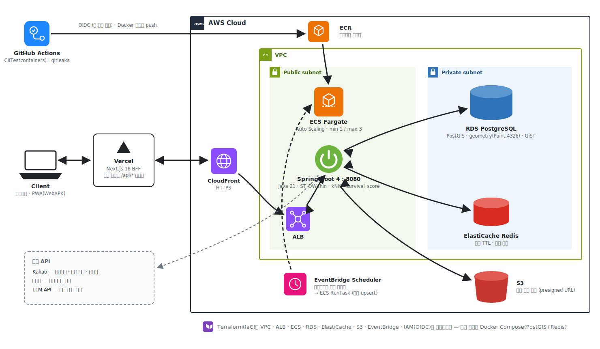
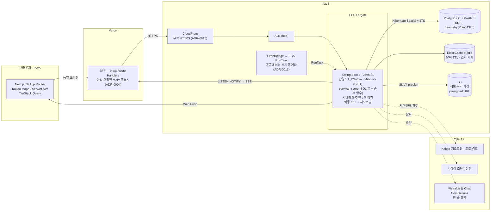
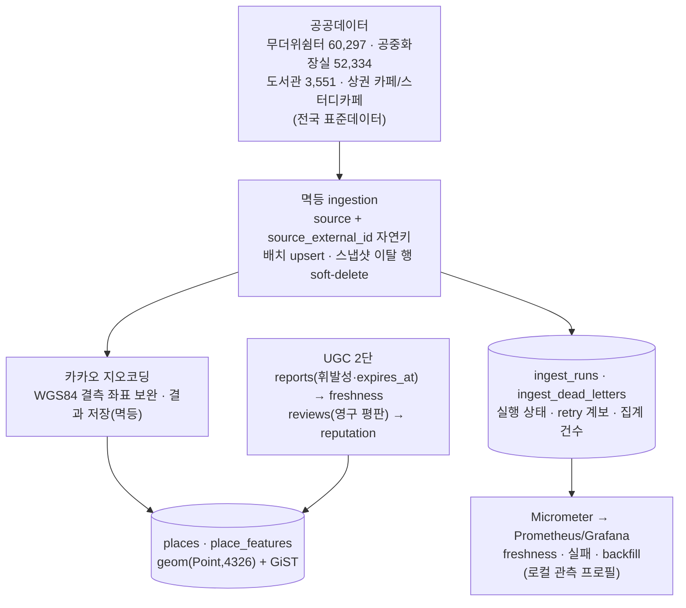
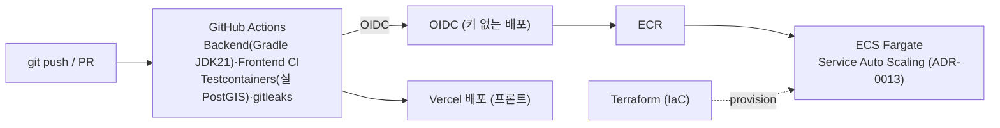
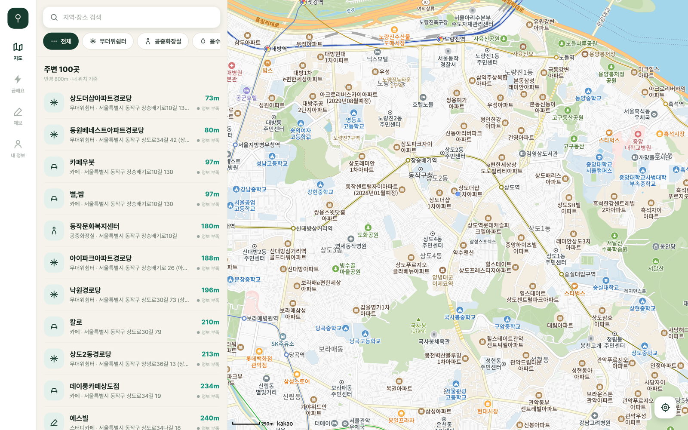
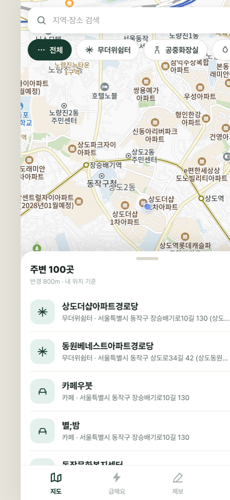
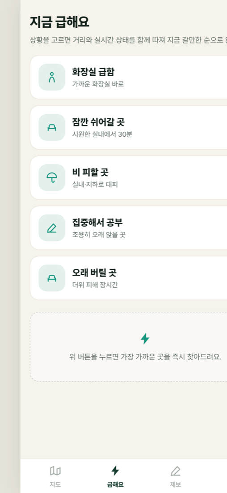

# 아키텍처 — 그늘(Geuneul)

> 런타임 데이터 흐름 + 배포 파이프라인. 핵심(PostGIS 대용량 지리검색 · 실시간 UGC 시공간 스코어링)이 어디서 돌고, 요청이 브라우저에서 DB까지 어떻게 흐르는지 한 장으로.
> 결정 근거는 각 노드의 ADR 링크 참고([색인](./adr/README.md)).

## 전체 구성

## 런타임 (요청 흐름)

- **동일 오리진 BFF** — 브라우저는 항상 Vercel 위 `/api/*` 서버 프록시만 호출한다. ALB(http)·CORS 제약을 동시에 회피(백엔드 CORS 불필요, [ADR-0004](./adr/0004-frontend-same-origin-proxy.md)). 외부 키(Kakao/KMA/AI)도 서버에만 있다.
- **공간 연산은 DB 레이어** — 반경(`ST_DWithin`)·최근접(kNN `<->`)·bounds는 GiST 인덱스로, 시공간 집계(`place_report_signals`)는 SQL 뷰로 돈다. 무거운 집계는 DB, 자주 튜닝하는 가중치 정책만 순수 Java 함수로 분리([ADR-0007](./adr/0007-survival-score-sql-signals-java-compose.md)).
- **실시간** — 제보 INSERT → Postgres `LISTEN/NOTIFY` → 멀티 인스턴스 팬아웃 → SSE 스트림 / Web Push. 과설계(Kafka) 없이 이미 있는 Postgres·Redis로([ADR-0016](./adr/0016-realtime-report-surge-listen-notify-sse.md)).

## 데이터 · ETL

- **멱등(idempotent)** — 같은 소스를 두 번 넣어도 중복이 안 생긴다(`source + source_external_id` 자연키 upsert). 스냅샷에서 사라진 행은 soft-delete로 비활성화한다(ADR-0002).
- **지오코딩 보완** — 공중화장실은 2025-02 이후 WGS84 좌표 미제공 → 카카오 로컬 API로 주소→좌표를 보완하고 결과를 저장(멱등·rate limit 회피).
- **운영 원장** — one-off 수집이 끝나도 V20 원장에 상태·카운터·동일 입력 digest retry 계보가 남는다. 실패 원본/주소 대신 집계형 dead letter만 저장하고, 상시 API가 이를 읽어 로컬 Prometheus/Grafana에 freshness와 backfill을 노출한다. API 전량 수집과 원격 CSV SHA-256을 DB mutation 전에 검증해 부분 snapshot의 거짓 성공을 차단한다([ADR-0030](./adr/0030-ingest-operational-ledger-deterministic-load.md)).
- **UGC 2단** — 제보(휘발성 상태, `expires_at`)는 `survival_score`의 freshness를, 후기(영구 평판)는 커뮤니티 콘텐츠를 굴린다. 시공간 랭킹은 DB(PostGIS/SQL)에서.

## 배포 (CI/CD · IaC)

- **키 없는 배포** — GitHub Actions가 OIDC로 AWS 역할을 맡아 장기 자격증명 없이 ECR 푸시·ECS 롤아웃([DEPLOY.md](../DEPLOY.md)).
- **IaC** — VPC·ALB·RDS·ElastiCache·S3·EventBridge·오토스케일링까지 Terraform으로 선언. 프론트는 Vercel, 로컬은 Docker Compose(PostGIS+Redis).
- **CI 게이트** — 공간쿼리·인제스천은 Testcontainers 실 PostGIS로 검증. 머지 전 `gh pr checks`로 Backend/Frontend pass 눈확인(TS-025).
- **무료 설치·배포** — `/install`에서 스토어 없이 $0 설치: 안드로이드 **WebAPK 원탭**(Chrome이 진짜 설치 앱 생성) + **다운로드 서명 APK**(Bubblewrap TWA, `/geuneul.apk` + `/.well-known/assetlinks.json` 도메인 검증) + iOS 홈 화면 추가. 서명 keystore는 레포 밖(로컬 비밀 저장소)에만 둔다.

---

## 데모

| 데스크톱 3분할 (지도앱 표준) | 그늘 경유 경로 + AI 요약 |
|---|---|
|  |  |

| 모바일 지도 (바텀시트 3단) | 시나리오 추천 |
|---|---|
|  |  |

> 모두 **라이브(geuneul.vercel.app) 실측 캡처**(2026-07, 필드테스트 거점 동작구 상도). 마커 상태 배지("정보 부족")는 촬영 시점 유효 제보가 없어 회색 — 제보가 쌓이면 survival_score 등급대로 초록/노랑으로 칠해진다.
